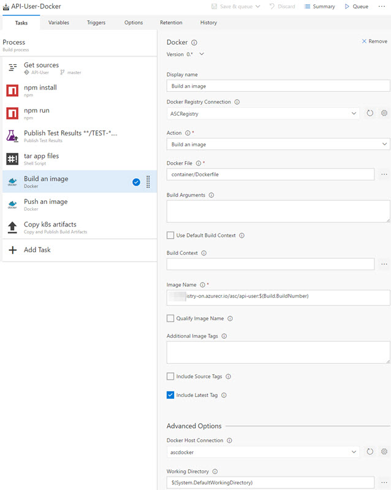

# Continuous Delivery to Kubernetes clusters using VSTS

See how to setup continuous delivery of a dockerized microservices app utilizing Visual Studio Team Services (VSTS) to a Kubernetes cluster running on top of Azure Container Service (ACS) or Google Container Engine (GKE).  Continuous Delivery involves several DevOps practices including continuous integration, continuous deployment, automated testing, and release management.

Prerequisites:

- Existing base deployment of an existing Kubernetes cluster on ACS or GKE.  To see how to do this, [see step 2 in this link from DEIS](https://deis.com/docs/workflow/quickstart/).
- Existing Visual Studio Team Services account.  [Create one for free](https://go.microsoft.com/fwlink/?LinkId=307137)
- Fundamental knowledge of how to use git version control
- Create an Azure Container Registry (ACR) account [See here](https://docs.microsoft.com/azure/container-registry/container-registry-get-started-portal)  Note: Other docker registries are supported, but steps in this article will reference ACR only.

Tasks to go through are as follows:

1. Setup Continuous Integration
1. Build and Push Docker Container to ACR
1. Setup Continuous Deployment
1. Setup Integration Tests
1. Release to different environments

## 1a. Setup Continuous Integration (CI)

First create a new VSTS build definiton to build and test the code.  The "API-User" example application used throughout is a Node.JS + Express REST API microservice defined using [Swagger 2.0](http://swagger.io/).  No matter the dockerized code desired, the overall flow for the entire article will remain the same.

Steps to do the build and tests will vary based on the app, but in this particular case the "API-User-Test" build definition installs dependent npm packages defined in the package.json file, runs the npm run test command to run unit tests, and then the standard test task finds and publishes the junit test reports to VSTS.

In this app case the npm run test executes `node node_modules/jasmine-node/lib/jasmine-node/cli.js --verbose --junitreport --output tests --captureExceptions tests/ ; rm -f mongodb-prebuilt-*` which does [jasmine](https://jasmine.github.io/) tests and outputs junit formatted test results as shown in VSTS:

Finally go to the "Triggers" tab and enable continuous integration for the master branch associated with this build definition.

## 1b. CI Developer Workflow (optional)

It is possible to simply check the CI checkbox and now anytime someone checks in code to the master branch, it will excute those steps.  However, the best way to do development in git is using pull requests with [branch policies](https://www.visualstudio.com/en-us/docs/git/branch-policies) on master which require a valid build to complete (i.e. using the above example build definition) and link to attached work items.  This way code can be peer reviewed, some assurance can be made that code checked into master does not break the build, and with an attached work item it is clear what work the code is trying to achieve.

## 2. Build the Docker Image and push to Azure Container Registry (ACR)

Now that the app code is being built and tested in an automated manner, it needs to be containerized using Docker in order to eventually be able to be deployed to a Kubernetes cluster. How to dockerize your application is beyond the scope of this post, but check out this article on [dockerizing the Parts Unlimited MRP application](https://microsoft.github.io/PartsUnlimitedMRP/adv/adv-21-Docker.html) and also included the [Dockerfile the API-User is currently using](./code/Dockerfile).

If following steps 1b, then an additional build defition should be created as a clone of the same steps above otherwise continue to edit the existing build definiton.  Either way, three more steps will be added to this build definiton. Namely:

1. Package up the application code - This optional, but can make it easier than manually copying all the required application files to the container.  As seen in the reference Dockerfile, simply "ADD asc.tar.gz /asc" unpacks the entire contents of the tar into the /asc directory in the container image filesystem.
1. Build the Docker Image - this built-in docker task builds the image with required tags on the docker host defined in the Advanced Options - "Docker Host Connection".  If no server is specified, assumption is that the VSTS build agent running the task has docker installed and is able to build the Dockerfile.  Important notes:
    - The image name must match the URL of ACR.  i.e. `myownname-on.azurecr.io/mypathtoorganize/imagename:$(Build.BuildNumber)` where the path is simply a best practice to not have too many images at the root of the repo and the Build.BuildNumber is automatically generated from VSTS.
    - Kubernetes works best if the EXPOSE command is present in the Dockerfile for necessary communication ports the app requires to function.
1. Push the Docker Image to ACR - built-in docker task pushes the image just built to ACR.  To configure this step, click on the gear icon to the right of the "Docker Registry Connection" section of the Docker task.  Add the service endpoint for Docker Registry connection and specify:
    - Docker Registry: `https://myownname-on.azurecr.io`
    - Docker ID and Password: Use either the admin account (comes by default after creation) or a service principal.  [This article](https://docs.microsoft.com/azure/container-registry/container-registry-authentication) explains authentication for ACR.

After this is set, simply ensure that Image name matches exactly what was defined in the previous Docker build step.

