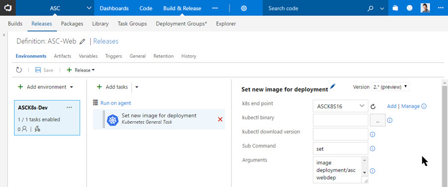

# Continuous Delivery to Kubernetes clusters using VSTS

See how to setup continuous delivery of a dockerized microservices app utilizing Visual Studio Team Services (VSTS) to a Kubernetes cluster running on top of Azure Container Service (ACS) or Google Container Engine (GKE).  Continuous Delivery involves several DevOps practices including continuous integration, continuous deployment, automated testing, and release management.

Prerequisites:

- Existing base deployment of an existing Kubernetes cluster on ACS or GKE.  To see how to do this, [see step 2 in this link from DEIS](https://deis.com/docs/workflow/quickstart/).
- Existing Visual Studio Team Services account.  [Create one for free](https://go.microsoft.com/fwlink/?LinkId=307137)
- Fundamental knowledge of how to use git version control
- Create an Azure Container Registry (ACR) account [See here](https://docs.microsoft.com/azure/container-registry/container-registry-get-started-portal)  Note: Other docker registries are supported, but steps in this article will reference ACR only.

Tasks to go through are as follows:

1. Setup Continuous Integration
1. Build and Push Docker Container to ACR
1. Setup Continuous Deployment
1. Release to different environments

## 1a. Setup Continuous Integration (CI)

First create a new VSTS build definiton to build and test the code.  The "API-User" example application used throughout is a Node.JS + Express REST API microservice defined using [Swagger 2.0](http://swagger.io/).  No matter the dockerized code desired, the overall flow for the entire article will remain the same.

Steps to do the build and tests will vary based on the app, but in this particular case the "API-User-Test" build definition installs dependent npm packages defined in the package.json file, runs the npm run test command to run unit tests, and then the standard test task finds and publishes the junit test reports to VSTS.


In this app case the npm run test executes `node node_modules/jasmine-node/lib/jasmine-node/cli.js --verbose --junitreport --output tests --captureExceptions tests/ ; rm -f mongodb-prebuilt-*` which does [jasmine](https://jasmine.github.io/) tests and outputs junit formatted test results as shown in VSTS:


Finally go to the "Triggers" tab and enable continuous integration for the master branch associated with this build definition.

## 1b. CI Developer Workflow (optional)

It is possible to simply check the CI checkbox and now anytime someone checks in code to the master branch, it will excute those steps.  However, the best way to do development in git is using pull requests with [branch policies](https://www.visualstudio.com/en-us/docs/git/branch-policies) on master which require a valid build to complete (i.e. using the above example build definition) and link to attached work items.  This way code can be peer reviewed, some assurance can be made that code checked into master does not break the build, and with an attached work item it is clear what work the code is trying to achieve.


## 2. Build the Docker Image and push to Azure Container Registry (ACR)

Now that the app code is being built and tested in an automated manner, it needs to be containerized using Docker in order to eventually be able to be deployed to a Kubernetes cluster. How to dockerize your application is beyond the scope of this post, but check out this article on [dockerizing the Parts Unlimited MRP application](https://microsoft.github.io/PartsUnlimitedMRP/adv/adv-21-Docker.html) and also included the [Dockerfile the API-User is currently using](./code/Dockerfile).

If following steps 1b, then an additional build defition should be created as a clone of the same steps above otherwise continue to edit the existing build definiton.  Either way, three more steps will be added to this build definiton. Namely:

1. Package up the application code - This optional, but can make it easier than manually copying all the required application files to the container.  As seen in the reference Dockerfile, simply "ADD asc.tar.gz /asc" unpacks the entire contents of the tar into the /asc directory in the container image filesystem.
1. Build the Docker Image - this built-in docker task builds the image with required tags on the docker host defined in the Advanced Options - "Docker Host Connection".  If no server is specified, assumption is that the VSTS build agent running the task has docker installed and is able to build the Dockerfile.  Important notes:
    - The image name must match the URL of ACR.  i.e. `myownname-on.azurecr.io/mypathtoorganize/imagename:$(Build.BuildNumber)` where the path is simply a best practice to not have too many images at the root of the registry and the Build.BuildNumber is automatically generated from VSTS.
    - Kubernetes works well if the EXPOSE command is present in the Dockerfile for necessary communication ports the app requires to function.
1. Push the Docker Image to ACR - built-in docker task pushes the image just built to ACR.  To configure this step, click on the gear icon to the right of the "Docker Registry Connection" section of the Docker task.  Add the service endpoint for Docker Registry connection and specify:
    - Docker Registry: `https://myownname-on.azurecr.io`
    - Docker ID and Password: Use either the admin account (comes by default after creation) or a service principal.  [This article](https://docs.microsoft.com/azure/container-registry/container-registry-authentication) explains authentication for ACR.  
  After this is set, simply ensure that Image name matches exactly what was defined in the previous Docker build step.

1. Publish required Kubernetes artifacts for Release - The files which deploy Kubernetes resources are done using JSON or YAML files.  Explanation of how to create these files is beyond scope of the article. [See here](https://kubernetes.io/docs/concepts/abstractions/overview/) as a starting point. However [here is the reference yaml file](./code/api-user.yaml) used to publish this API-User app to Kubernetes.  Note: It's important to call out the lines at the end which reference the secret Kubernetes will use to pull the image pushed earlier into ACR.  The secret with this name will be covered in step 3.4 below.

    ```yaml
          imagePullSecrets:
            - name: ascreg
    ```

    Now check-in the defined YAML file and [kubectl executeable](https://kubernetes.io/docs/user-guide/prereqs/) into the source repo, add the "Copy and Publish Build Artifacts" task, and specify the location of where the YAML and kubectl files are located in the contents box separated by a new line.
     > Note: Currently the Kubernetes task requires kubectl checked into source, but this could change in future versions of the task.  If multiple services are using kubectl or the desire is to reduce the size of the repository, it is best to check kubectl into a separate code repository, publish just the kubectl artifact, and then link that build artifact the desired VSTS release definitions.

    

## 3. Setup Continuous Deployment

Now that the image is built and pushed to the private Docker image registry (ACR), it is time setup continuous deployment of the image to the Kubernetes cluster using the release management area in VSTS.  Follow these steps:

1. Install the [Kubernetes task from the VSTS marketplace](https://marketplace.visualstudio.com/items?itemName=tsuyoshiushio.k8s-endpoint) to the VSTS subscription being used. Note: This requires the owner permissions of the VSTS subscription.
1. Add a new Kubernetes Service Endpoint in VSTS -  in order to be able to access to the cluster to do deployments.
    - Connection Name - can be whatever name makes most sense to you
    - Server URL - This is the external endpoint to the Kubernetes cluster.  For ACS + Kubernetes this would be something like `https://myownname.westus.cloudapp.azure.com` and for GKE it might be something simply like `https://104.196.235.251`.
    - Kubeconfig - this is a copy and paste of the contents inside the config file pulled securely from the Kubernetes master node of the cluster.  For more information on how to obtain this information, see the DEIS link referenced at the top of the page which provides steps to obtain both of these values from a Kubernetes cluster hosted on Azure, Google, or Amazon cloud providers.
1. Create a new release definition
Create a new release definition and add the Kubernetes apply task and the general task.
    - Apply Task - specify the location of the yaml file which will configure your desired Kubernetes resources from the artifacts published in step 2.4 above.  This will execute the equivalent of `kubectl apply -f yourfile.yaml` which creates the resources specified in the yaml file if they aren't already created against the Kubernetes cluster setup in step 3.2 above.  Note: line # in the example yaml file specifies the Kubernetes namespace `ascdev` for the deployment and line # specifies `apiuserdep` as the name of the deployment which is used in the command executed next.  

    Technically this could be the only step executed for a deployment, but what happens when a new container image needs to be deployed?  If the yaml file uses the latest tag and the imagePullPolicy is set to always, it will update.  The challenge here is it takes more digging to know what actual build is associated with the latest tag for the deployment. If it's desired to use a tag associated with a build to deploy - then there are two major options 1) update the yaml file which references new tagged versions of the image - this could be via source code (but is challenging because of not knowing the build number) or via a tokenizer task to modify the yaml build number in this phase of the release.  2) Execute the `kubectl set image` ... command as explained in the general task next.
    - General Task - specify the base kubectl command `set` and then `image deployment/apiuserdep api-user=myregistry-on.azurecr.io/asc/api-user:$(Build.BuildNumber) --record --namespace=$(namespace)`  
    
    The example yaml file deploys the newly built image associated with the existing `apiuserdep` deployment and when executing `kubectl rollout history deployment/apiuserdep` it will show the newly deployed image in history.
1. One-Time Prep Kubernetes cluster - adding the namespaces to deploy to and the secret used for ACR is required for the deployment to the Kubernetes deployment to be successful. These steps could be added as tasks to VSTS similar to above, but generally they are very infrequent so listing these as manual operations to apply using kubectl on your own host machine against the desired Kubernetes cluster.
    - Namespaces - are the way Kubernetes allows complete separation of resources and management within the same cluster.  The primary use case in this example makes it possible to deploy a "development" i.e. `ascdev` and "production" i.e. `ascprod` environment using the same exact names of resources on the same cluster. By default resources will deploy to the default namespace and this step is uncessary if deploying the same resources to different Kubernetes clusters.  To create the namespaces, simply execute `kubectl apply -f namespaces.yaml` where [namespaces.yaml](./code/namespaces.yaml) is the sample code.  Learn more about [Kubernetes namepaces](https://kubernetes.io/docs/user-guide/namespaces/).  
    
    In step 3.3 the $(namespace) command was added so the kubectl command was executed against that namespace. In the "Dev" environment, Click the ... and then "configure variables" and add a local variable called `namespace` and give it a value of the namespace to deploy to. i.e. `ascdev`.  
    
    - Add Kubernetes secret for ACR - this enables Kubernetes to authenticate to ACR to pull down the images.  Execute the command:

    ```yaml
    kubectl create secret docker-registry ascreg \
    --docker-username='yourACRuser' \
    --docker-password='yourACRpassword' \
    --docker-server='myregistry-on.azurecr.io' \
    --docker-email='youremails@yourdomain.com' \
    --namespace=ascdev
    ```
    The --namespace is only required if not using the default or already in this namespace context to set the secret.  If secrets rotation is desired, then it could also easily be added as a Kubernetes general task and the password could be added as a defined global environment variable for the release.

1. Enable CD Trigger - Now to setup continuous deployment, the only step needed is to go to the triggers tab and enable continuous deployment from the build setup earlier.  
  
Now go to the deployment conditions for the dev environment and set it to automatically trigger "after release".

Now when a pull request is approved, the build will automatically happen and trigger a deployment to the Kubernetes cluster!

## 4. Release to different environments