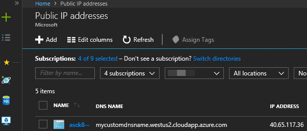

# K8s Ingress Controller on Azure with Public DNS label

Learn how to setup an nginx ingress controller on Azure which will have an attached K8s service with public IP address and a DNS label.  The DNS label is not required to deploy an ingress controller, but is a new feature in K8s 1.9 [(see this PR if desired)](https://github.com/kubernetes/kubernetes/pull/47849), enables traffic manager to manage traffic in front of your cluster endpoint, and have persistence in case the IP address changes.

Prerequisites:

- An existing 1.9+ kubernetes cluster deployed Azure with kubectl access.  This could be [ACS-Engine](https://github.com/Azure/acs-engine/blob/master/docs/kubernetes/deploy.md) or [AKS](https://docs.microsoft.com/en-us/azure/aks/tutorial-kubernetes-deploy-cluster).
- Helm 2.8+ installed on the client and matching version on the K8s cluster

This is the workflow to follow:

1. Configure Helm Chart Values
1. Deploy the Helm chart / Nginx Ingress Controller

## 1. Configure the Helm Chart Values

The existing [public helm chart for an nginx-ingress controller](https://hub.kubeapps.com/charts/stable/nginx-ingress) works great.  This chart deploys the customized flavor of nginx controller for kubernetes.  [This post from nginx](https://github.com/nginxinc/kubernetes-ingress/blob/master/docs/nginx-ingress-controllers.md) explains the differences between it and out-of-the-box nginx and nginx-plus.

There are some important customizations to the default values.yaml from the helm chart to explain.  [Here is the full file](./code/values.yml) in this repo.

- **image and tag** - The default chart at the moment is out of date with the latest nginx image, so we're overriding it with the publicly available values:

```yaml
controller:
name: controller
image:
    repository: quay.io/kubernetes-ingress-controller/nginx-ingress-controller
    tag: "0.9.0"
```

- **Controller Service annnotations** - This is the K8s service of type loadbalancer provisioned which will create a public IP address.  We need to add this label so it will have this dns name.  Change the name to be something globally unique per the datacenter where you are deployed.

```yaml
service:
    annotations: {service.beta.kubernetes.io/azure-dns-label-name: "mycustomdnsname"}
```

- **RBAC configuration** - If your K8s cluster uses RBAC you need to configure this to be set to "true" and change the serviceaccountname IF needed/desired.  AKS currently does not support RBAC, ACS-Engine has it turned on by default.

```yaml
rbac:
  create: true
  serviceAccountName: default
```

## 2. Deploy the Helm chart / Nginx Ingress Controller

Now deploy the helm chart using this command change the namespace if desired:

```shell
helm install --name nginxcontroller stable/nginx-ingress -f values.yml
```

The following command will allow you to see the annotation on the service and when the public IP address gets provisioned:

```shell
kubectl describe svc nginxcontroller-nginx-ingress-controller
kubectl get svc -w
```

Go to the Azure portal, add the Public IP address Resource, add the DNS label column and see the DNS name is present.



## Next Steps

Now the controller is deployed which is ready to receive traffic on the public IP / DNS name.  The nginx controller has no rules defined, so it doesn't know where to send anything.  For this a [K8s Ingress resource](https://kubernetes.io/docs/concepts/services-networking/ingress/) will need to be configured and deployed to tell the nginx controller how to route the traffic to other services which exist on the K8s cluster.

The main thing which needs to be present in the Ingress resource is the below annotation to link the ingress rules to the deployed nginx controller:

```
ingress:
  enabled: true
  rules: 
    mycustomdnsname.westus2.cloudapp.azure.com:
      - path: /
        serviceName:
        servicePort: 8080
  annotations:
    kubernetes.io/ingress.class: "nginx"
```

After this it might be desired to put traffic manager in front of the ingress controller. Traffic manager is incredibly useful if you have more than one K8s cluster for performance (i.e. around the world with federation), fault tolerance, and enables a great way to migrate to a new cluster with little to no downtime.